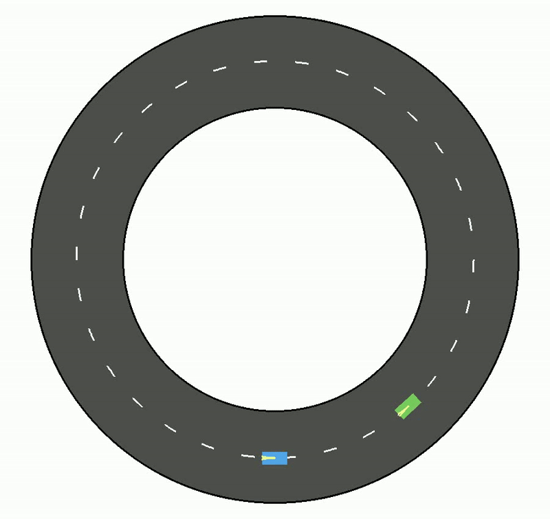

# Race Simulation 
 


This repository contains the implementation for the simulated autonomous vehicle races featured in the conference paper "Vector Cost Bimatrix Games with Applications to Autonomous Racing" and the expanded journal version, "Vector Cost Behavioral Planning for Autonomous Robotic Systems with Contemporary Validation Strategies". The journal paper is currently under review as of 11-26-25, so please use the following citation for now if you decide to use any of these tools:

Citation:
```
@misc{toaz2025vectorcostbehavioralplanning,
      title={Vector Cost Behavioral Planning for Autonomous Robotic Systems with Contemporary Validation Strategies}, 
      author={Benjamin R. Toaz and Quentin Goss and John Thompson and Seta Boğosyan and Shaunak D. Bopardikar and Mustafa İlhan Akbaş and Metin Gökaşan},
      year={2025},
      eprint={2511.17375},
      archivePrefix={arXiv},
      primaryClass={cs.RO},
      url={https://arxiv.org/abs/2511.17375}, 
}
```

## Abstract

The vector cost bimatrix game is a method for multi-objective decision making that enables autonomous robotic systems to optimize for multiple goals at once while avoiding worst-case scenarios in neglected objectives. We expand this approach to arbitrary numbers of objectives and compare its performance to scalar weighted sum methods during competitive motion planning. Explainable Artificial Intelligence (XAI) software is used to aid in the analysis of high dimensional decision-making data. State-space Exploration of Multidimensional Boundaries using Adherence Strategies (SEMBAS) is applied to explore performance modes in the parameter space as a sensitivity study for the baseline and proposed frameworks. While some works have explored aspects of game theoretic planning and intelligent systems validation separately, we combine each of these into a novel and comprehensive simulation pipeline. This integration demonstrates a dramatic improvement of the vector cost method over scalarization and offers an interpretable and generalizable framework for robotic behavioral planning.

## Branches

The main branch includes the infrastructure for building and visualizing the simulation, as well as healess data generation with automatic iteration through the vehicle parameters described in the paper. The scenario_visualization repository is included [here](https://github.com/toazbenj/scenario_visualization) to make the XAI and visualization tools available. Also see the web app [Race Simulation](https://racesimulation.streamlit.app/) (may take some time to load). The experimental branch is where active feature construction is underway and is not reccomended for use. Sembas branch is set up to connect the simulation to its counterpart in the SEMBAS repository, which is available in this fork of the SEMBAS repo [here](https://github.com/toazbenj/racing_sembas/tree/main). More details for use can be found on the sembas branch readme. The legacy_mecc2025 branch is the state of the repository as of the submission date of the previous paper and includes the data used for that publication as well. 

## Installation

1. **Clone the Repository**:

   ```bash
   git clone https://github.com/toazbenj/race_simulation.git
   ```

2. **Navigate to the Project Directory**:

   ```bash
   cd ~/race_simulation
   ```

3. **Install Required Dependencies**:

   ```bash
   pip install -r requirements.txt
   ```

## Basic Usage
   
1. **Execute the Main Script within the bike_race folder**:

   ```bash
   cd ~/race_simulation/bike_race
   python3 main.py
   ```

   This will launch the simulation window where you can watch the races. You can generate videos of the simulation using bike_race/view.py.

2. **Using the simulation**:

   You can skip to the next race using the big red skip button if the race gets boring. Data is saved to the files cost_stats.csv for information related to each turn (vehicle states, costs applied, actions taken) and race_stats.csv for data over the entire game (wins, collisions, out of bounds, etc). These are in the data folder. For headless mode, run the following script for pure data generation:
   ```bash
   cd ~/race_simulation/bike_race
   python3 data_generation.py
   ```

   The data will appear in the cost_stats.csv and race_stats.csv files in the data folder. You can edit the file names/paths in bike_race/constants.py. The script will iterate through all spawning and decision making weights automatically, creating a large amount of grid search data. These files are what can be fed into the XAI software, which is included in the scenario_visualization repository.

3. **Editing Configurations**:

   All parameters are included in the constants.py script. To edit the decision-making method, switch the IS_VECTOR_COST flag to True. Note that P2 (green) is the attacker that does the passing in this case, while P1 (blue) is the defender who starts in front.
   ```bash
   P1_IS_VECTOR_COST = False
   P2_IS_VECTOR_COST = True
   ```

   You can also edit these parameters like the relative priorities of each objective along with the shape of the cost functions (slope).
   ```bash
   progress_weight = 1
   bounds_weight = 1
   prox_weight = 1
   
   PROXIMITY_SPREAD = 45
   BOUNDS_SPREAD = 205
   ```

   Note that you may have to adjust the file paths for where the data is being saved if you are on windows vs linux (add/subtract a . at the beginning to change directories).
