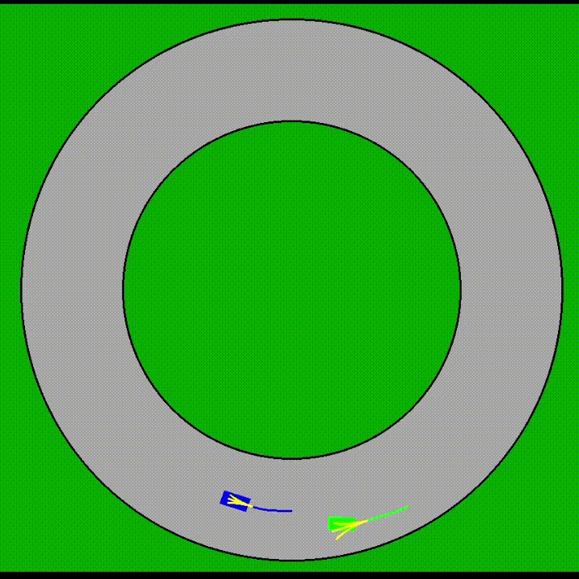

# Race Simulation 
 


This repository contains the implementation for the simulated autonomous vehicle races featured in the paper: Vector Cost Bimatrix Games with Applications to Autonomous Racing. The code includes an object-oriented python GUI and data generator, which can be used in headless mode for improved performance. 

Citation:
```bash
@misc{toaz2025vectorcostbimatrixgames,
      title={Vector Cost Bimatrix Games with Applications to Autonomous Racing}, 
      author={Benjamin R. Toaz and Shaunak D. Bopardikar},
      year={2025},
      eprint={2507.05171},
      archivePrefix={arXiv},
      primaryClass={cs.GT},
      url={https://arxiv.org/abs/2507.05171}, 
}
```

Note that this repository has been updated since the publication and some branches are under active construction. Main is the branch that will always be kept stable with new features as they come in. The legacy_mecc2025 branch is the frozen state of the code as of the publication date. The experimental and sembas branches are where new features are currently being developed (and are not safe places for mortals to tarry).

## Abstract

We formulate a vector cost alternative to the scalarization method for weighting and
combining multi-objective costs. The algorithm produces solutions to bimatrix games that are
simultaneously pure, unique Nash equilibria and Pareto optimal with guarantees for avoiding
worst case outcomes. We achieve this by enforcing exact potential game constraints to guide
cost adjustments towards equilibrium, while minimizing the deviation from the original cost
structure. The magnitude of this adjustment serves as a metric for differentiating between
Pareto optimal solutions. We implement this approach in a racing competition between agents
with heterogeneous cost structures, resulting in fewer collision incidents with a minimal decrease
in performance. 


## Installation

1. **Clone the Repository**:

   ```bash
   git clone https://github.com/toazbenj/race_simulation.git
   ```

2. **Navigate to the Project Directory**:

   ```bash
   cd ~/race_simulation
   ```

3. **Install Required Dependencies**:

   Ensure that Python and Pygame are installed on your system. You can install Pygame using pip:

   ```bash
   pip install -r requirements.txt
   ```

## Usage

To run the simulation:
1. **Edit the configuration file constants.py in the bike_race folder.**
   
2. **Execute the Main Script within the bike_race folder**:

   ```bash
   cd ~/race_simulation/bike_race
   python3 main.py
   ```

   This will launch the simulation window.

3. **Using the simulation**:

   You can skip to the next race using the big red skip button if the race gets boring. Data is saved to the files cost_stats.csv for information related to each turn (vehicle states, costs applied, actions taken) and race_stats.csv for data over the entire game (wins, collisions, out of bounds, etc). These are in the data folder. For headless mode, run the following script for pure data generation:
   ```bash
   cd ~/race_simulation/bike_race
   python3 data_generation.py
   ```
3. **Editing Configurations**:

   All parameters are included in the constants.py script. To edit the decision-making method, switch the IS_VECTOR_COST flag to True. Note that P2 (green) is the attacker that does the passing in this case, while P1 (blue) is the defender who starts in front.
   ```bash
   P1_IS_VECTOR_COST = False
   P2_IS_VECTOR_COST = True
   ```

   You can also edit these parameters like the relative priorities of each objective along with the shape of the cost functions (slope).
   ```bash
   progress_weight = 1
   bounds_weight = 1
   prox_weight = 1
   
   PROXIMITY_SPREAD = 45
   BOUNDS_SPREAD = 205
   ```
   

